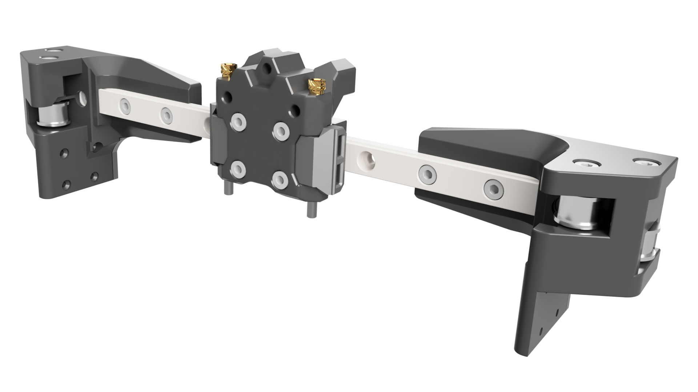
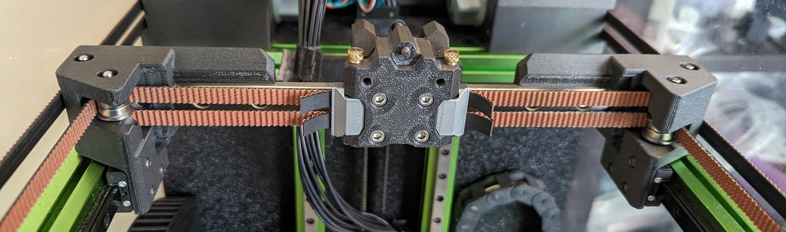
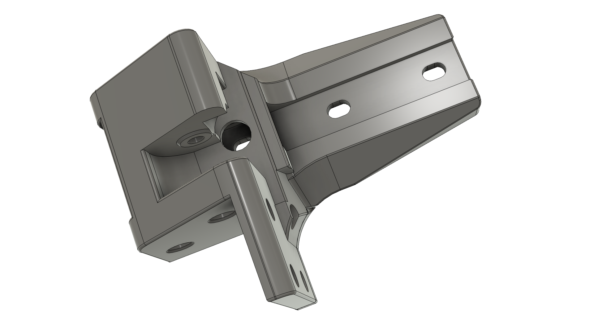
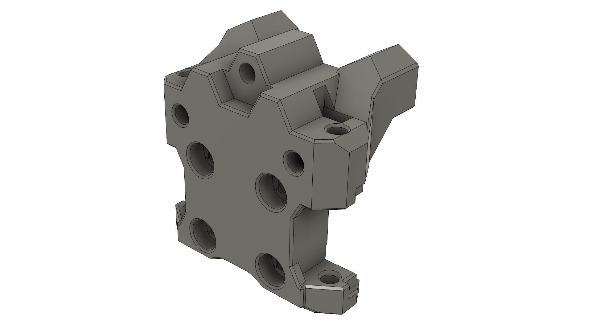
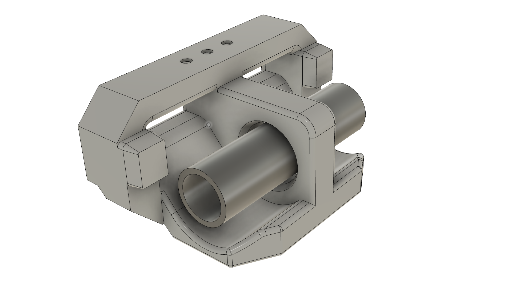
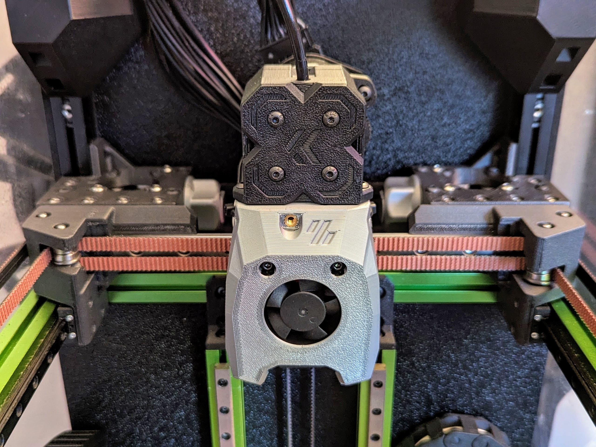
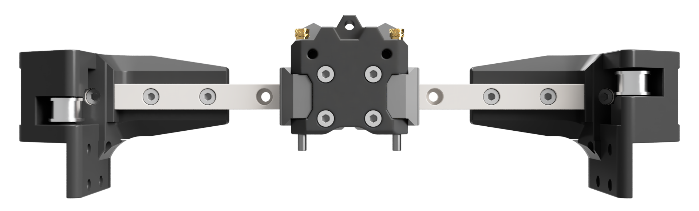
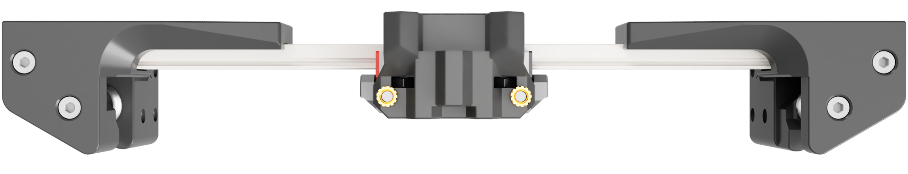
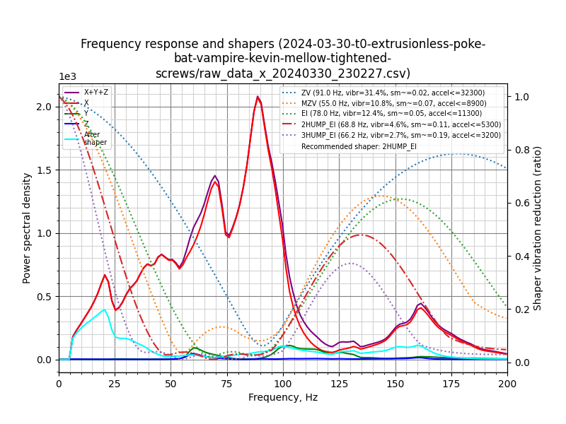
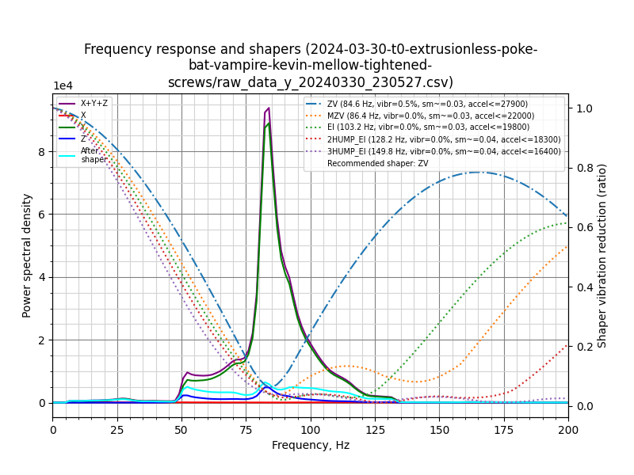

## Vampire Bat - a pinned extrusionless gantry with pin-in-tube belt clips

The **Vampire Bat** gantry system includes 3 distinct parts:

|  |  |  |
| --- | --- | --- |
| **Bat** XY joints | **Vampire** pinned X carriage | **Vampire** pin-in-tube belt clips |

**Together**: these 3 parts yield a rigid, easier-to-build, easier-to-install-belts gantry that drops into an otherwise-stock V0, with little-to-no X or Y travel loss!

**Bat XY joints only**: *Not ready to enter the world of pins, clips, and tubes?  No problem.*    Pick your favorite front-facing X carriage from many choices - Micron, Salad Fork, Pandora/Pandora's Box, Boop, and mmaybe even Archetype and Xol carriages in the future.  Few toolheads fit a V0.2 mount, so more options for interesting new toolheads on smaller printers is a Good Thing.

**Vampire X carriage and clips only**: *Don't have a V0?  No problem.*  Enable the ease of pins on any Micron, Salad Fork, Dueling Zero, or Pandora's Box: faster attachment and completely repeatable tensioning. You can then swap out motors, or swap out rails, in just minutes, without needing to retighten and rematch belt tensions. Should work on any PFA printer with 6mm belts, 3mm belt spacing, and a front-facing MGN9H rail.  

## Updates

* 2024-04-03: Thanks `thor`!  Fixed minor bridging issues near MGN9 entrance and belt tunnel.
* 2024-04-02: Added IS Graphs.

## Features
* Compatibility with MiniSB and derivatives (Mini Stealth Sherpa, Hacky Boi, and more)
* Compatibility with most front-facing PFA carriages, including Boop
* Faster assembly from elimination of both washers and spacers ( :tada: )
* Faster belt installation from more-constrained belt paths; no more poking with an allen key from the side, or needing to remove side panels
* Repeatable belt tensioning; can even remove clips while tensioned
* Supports fully pinned bearings, which prevent over-torqueing that can lead to skipped steps and messy resonance graphs
* All screws are easily accessible when mounted
* Full 120mm+ X and Y travel with BoxZero; ~118mm with regular V0

## Support the creator
Like what you see?  [Buy me a coffee](https://ko-fi.com/zruncho3d) to show the love and enable future mods and content - stuff like [F0](https://github.com/zruncho3d/f-zero), [T0](https://github.com/zruncho3d/tri-zero), [B0](https://github.com/zruncho3d/boxzero), [X0](https://github.com/zruncho3d/double-dragon), [D0](https://github.com/zruncho3d/DuelingZero), [DX](https://github.com/zruncho3d/DuelingX), [ZeroPanels](https://github.com/zruncho3d/ZeroPanels), [ZeroClick](https://github.com/zruncho3d/zeroclick), [NoDropNuts](https://github.com/zruncho3d/f-zero/tree/main/STLs/NoDropNuts), [Poke](https://github.com/zruncho3d/poke), and more.

 :heart: *-Zruncho*

Or, read more below if this seems interesting.....

Shown above: gantry parts in 3DXTech CF-ABS + clips in KVP MSIL ABS.  Printer is a custom [Fully-Boxed](https://github.com/zruncho3d/boxzero) [Tri-Zero](https://github.com/zruncho3d/tri-zero) with toolhead by Kevinakasam, plus [Papilio Lite](https://github.com/kevinakasam/Papilio-Belt-Extruder) belt extruder.  This extruder printed the CF-ABS parts like a champ.

## Parts Explained

|  |  |
| - | - |

**Bat XY Joints**: the core idea is to print the XY joints on the rear-facing surface as a single piece, and to constrain the the rail inside (vs as a two-part assembly, on a V0).  Compared to a V0, this is faster and easier to assemble, has way fewer parts (no spacers, washers, or self-tapping screws), is plenty rigid, and is lighter.

The print-orientation concept is based on a [top-facing extrusionless V0 gantry from TheMrFish](
https://discord.com/channels/825469421346226226/875884022285369344/1035022744766652416).  The overall concept is inspired by an [earlier front-facing extrusionless V0 from richardjm](https://github.com/richardjm/voron-parts/tree/main/voron-0.1/Mgn9h).

There's a lot of care to get the tiny vertical bars to acts as supports so that the front-facing filled-in areas can print well.

**Vampire X carriage**: the upper geometry is [Pandora-X-carriage-derived](https://github.com/MasturMynd/Pandora/blob/main/STLs/X_Carriage/MGN9-H_X_Carriage.stl), and includes V0.2-carriage-compatible rear heatset holes for a strain relief or toolhead board.  The CAD derives from [Boop beta-4](https://github.com/PrintersForAnts/Boop/tree/main/beta_4).

**Vampire belt clips**: belts go through a thin slot, then a tube drops in, and the belt wraps around the tube.  The geometry is loosely inspired by [Archetype's clips](https://github.com/Armchair-Heavy-Industries/Archetype/blob/main/Archetype%20Core/Rail%20Mount/%5Ba%5D_belt_clamp_pair.stl), but vastly smaller, and earlier versions were part of [experiments into Pinned Boop](https://www.youtube.com/watch?v=ZaqttrUeE4I).

## Instructions

Required tools:
* (carriage pins option only)
  * small vise
  * ~2.9mm drill bit
* 4mm drill bit for clips
* soldering iron for heatsets

Preferred tools:
* (carriage pins option only) 3mm reamer
* glue

#### Print the parts
* Standard Voron settings are fine.  Add infill beyond 40%, if you'd like; can't hurt.
* This part is near heat; use a temp-resilient material like ABS.

#### Prep the parts
* Remove supports from the XY joints.
* Ream out the two vertical pin holes in the X carriage.  Pins should slide smoothly into the hole.
* Test-fit each tube into a belt clip; may need the 4mm drill bit to open up the hole slightly.
* Test-fit each belt clip into the carriage, and drop the pin in; it should have little to no resistance.  If there's resistance, look through the pin hole and maybe X-acto away a bit of material.
* Screw the 2x M3x30 BHCSes up from the bottom, into the X carriage, until there's a small gap.  Push hard to start forming the threads and make sure they stay aligned against the plastic.
* Assemble pins (2x)
  * Put heatset in a bench vise, with the thin end facing up.
  * Using a 2.9mm or similar drill bit, drill through the hole.
  * Twisting slightly while running the drill, open up the hole on the bottom just a tad, so it tapers.
  * Using the vise, push the pin through the now-slightly-tapered heatset hole, on the wider side; the brass should yield to the steel.  If the heatset breaks, drill a larger hole; 2.95-2.98mm or so is about ideal for a press fit.
* Drop the m3 nuts into the slots on the X carriage; optionally add a small spot of glue, using a toothpick.

#### Assemble the XY joints
* Melt in heatsets (2x) if using screws + heatsets option.
* Push in a bearing pair on an XY joint, then drop in the pin or screw; repeat 4x.
  * Pins may need a little bit of persuasion; align tops of pins to tops of XY joints.

#### Assemble the Gantry
* Push the MGN9 rail in one end, then the other.  Yes, it'll be tight.  Go slow until the screw-holes show the full counterbores.  Be careful.  It will need a fair amount of persuasion, intentionally.
* Align the rail holes to the XY joint holes.
* Add the 6x M3x8 SHCS into the rail holes, then add matching nuts in back. *Don't tighten fully yet*.  The XYs should slide along with the rail.

#### Assemble the X Carriage
* Push the X carriage onto the metal rail carriage, until it clicks and locks. Align it.
* Tighten the 4 M3x8 SHCS for the carriage, fully.
* Tighten the two M3x30 BHCS up from the bottom, fully.

#### Install the gantry and belts
These steps assume no gantry is  present.
* Twist the gantry a bit along the Z axis, and add the two belts from the ABs, pushing through.
* Push two belts from the front idlers through; the channels and bearings should guide the belts through.
* Rotate so the gantry is in the expected position, then set it on the Y carriages.
* Tighten all 8 M2 screws.
* Push or pull on the XY joints until there's no binding during motion; move to test.
* Tigten 6 rail screws, fully.
* Attach first belt clip.
  * Push first belt through, then wrap around, and using pliers to squish the belt against itself, push through the slot, carefully and slowly.  Add tube and tighten until just grabbed.
  * Push second belt through, similarly, and try to match the first in length.  If not the exact same length, keep holding the position, slide it out, and then move it a tooth or two at a time.  Re-push it through and compare.  You want perfect alignment on the first end, to be able to match on the second.
  * Put clip into X carriage and drop the pin in.
* Attach second belt clip.
  * Same as first... but you'll need to put it at a setting that makes it hard, but possible, to put into the "pin position" on the carriage.  You want it to start with a bit of force, as the V0 doesn't have that much tensioner travel.  
  * Once one side feels about right, match the other.  
  * Then, squeezing the clip in, push the pin through.

To release tension, just push up the pin and remove; this is why the spec pin length enables a bit of "overbite", to give more grip.  If still not enough grip, use pliers.  To re-add tension, squeeze again and push the pin through.  Much easier and faster than without pins!  You get faster at putting the clips on, too.

## BOM

Bat XY joints (for set of 2):
* Parts shared with V0 XY joints
  * 8x M2x6 FHCS
  * 6x M3 nuts
  * 8x F623 bearings
* New parts to buy
  * 200mm MGN9H rail: high-preload (Z1)
    * Rails can be slightly shorter (up to 50mm) and may work fine, by using the innermost two screws, instead of 3.
  * 6x M3x8 SHCS
  * Pins Option
    * 4x 3mmx30mm Steel pins
    * 4x M3x4mm "Voron standard" heatsets
  * Screws + Heatsets Option
    * 4x M3x30 SHCS
    * 4x M3x4mm "Voron standard" heatsets

Vampire X Carriage:
* 2x M3x40 BHCS/SHCS (to attach toolhead)
* 2x M3 nut (to attach toolhead)
* 2x 3mmx40mm Steel pins preferred
  * If you can't find these, 35mm, 45mm, and 50mm lengths will work
  * M3x35mm/40mm BHCS/SHCS/FHCS will also work.  
* 2x M3x4mm "Voron standard" heatsets (for rear V0.2 strain relief/toolhead holes)
* 4x M3x8 SHCS (for carriage mounting)
* 1x M3 BHCS/SHCS for (third V0.2 screw) - typically 16mm, but depends on toolhead
* 2x M3x30 BHCS (for carriage stiffening) or SHCS in a pinch

Belt clips (for set of 2):
* 2x tubes: 15mm-long 4mm OD, 3.2mm ID - in Al, Brass, or Steel
  * Slightly shorter, like 14.8mm, may help with insertion.  File to length.

### Status: Experimental

Until there are a bunch of builds, it'll be categorized as beta/experimental, but...

Zruncho has been using a weaker extrusionless gantry and pinned carriage (from Pinned Boop) for all of 2023 without ill effects.

### Resonance testing

Graphs are from a Boxed Tri-Zero with experimental dropped Z extrusions, PapLite, Kevinakasam MiniSB-derived toolhead, GT2 belts, Vampire Bat gantry, and Mellow ADXL345 with CNC mount.

Roughly 30K is pretty good.  

Note the low spectral density on X (200) vs Y (9000); a high preload rail may be causing low-frequency attenuation effects here.  This should be a fast swap to test, though... no need to retension belts!

|  |  |
| - | - |
| X: 32K | Y: 28K |

### CAD Note: flip the parts after STL export!

The CAD shows the wrong chirality - that is, the filled-in areas were done in a way that doesn't match the V0 convention, so it will NOT work if you just print the parts from CAD.  It's too much CAD work to flip the chirality, so the parts are all mirrored after STL export.  MAKE SURE to mirror if you use the CAD and do any exports.  

Note, all STLs here are pre-mirrored to the correct orientation, so if you just grab the STLs, *you don't need to do anything*.

### FAQ

#### Why the name?

The pins stick out a bit, creating an overbite, making the Vampire carriage the first part here to be named.

When combined with an MGN9 rail, the XY joints kind look like a bat from the front and top.

It even kinda looks like a vampire bat!  The carriage has eyes, ears, a mouth, and teeth.

Did you know? Vampire bats are the only mammals to have evolved to feed exclusively on blood, a trait called hematophagy (according to [Wikipedia](https://en.wikipedia.org/wiki/Vampire_bat)).  

#### Is going extrusionless a bad idea?

Think about it: on something as small as the V0, the toolhead and frame are more likely to be the limiter than the gantry not having a backing extrusion.  This is not how machine tools are supposed to be designed; the extrusion or backer helps lock the rail flat, and in place.  

But in practice, it all seems just fine, and the options that having a front-facing rail opens up - those seem worth it.  The lack of a flexible plastic L shape might help with resonances, as does the removal of 25-30g from the extrusion.

More importantly, in practice, it prints fine, and the IS results are fine.  Other stuff seems to matter more: rail quality, toolhead design/weight, and frame rigidity.

## Future work
If this gets traction...
* More sizes - the f3d file is parametric, and scales to different numbers of backing nuts, with varying overhang and Y-carriage holes shifts... but it became fragile right before release, so this isn't an advertised feature.
* "Perimeter adders" - tiny slots, to add material without needing to change settings, like Boop has.
* Sanding tool - would be helpful to get the tubes the right length, without getting an unwanted angle.

### Special Credits:
* **Thor** for helping talk through various design concepts.
* **Leddhedd** for helping think through various clip options.

### Timeline
* 2024-03-31: April Fool's Eve release! :tada:
* 2024-03-30: Resonance tests show nothing of interest :thumbsup:
* 2024-03-24: Nuts moved behind pins, to enable 8-9mm thickness
* 2024-03-14: Vampire carriage takes shape at thicker 12mm depth
* 2024-03-14: Spacers and washers eliminated
* 2024-03-10: Bat gantry first modeling and first prints
* 2023-midyear: Belt clip testing with Pinned Boop

